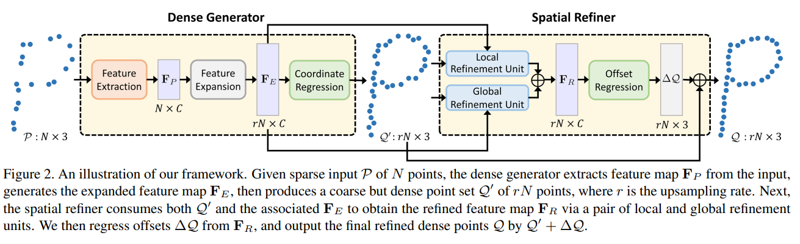
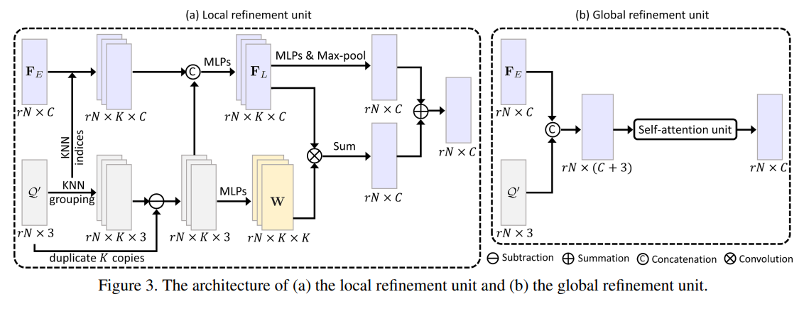
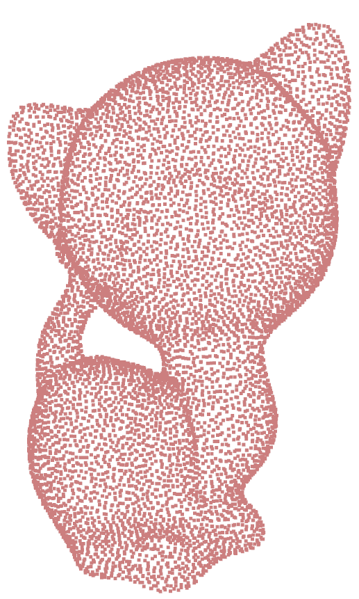
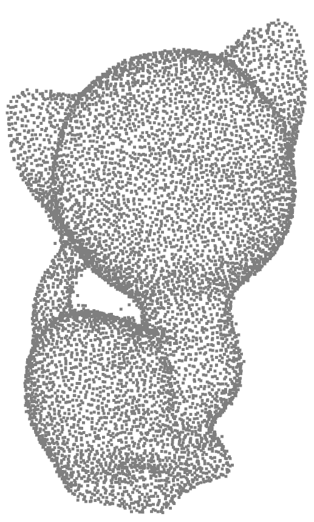

# Dis-PU-pytorch
Pytorch unofficial implementation of Dis-PU

(Point Cloud Upsampling via Disentangled Refinement)

https://arxiv.org/abs/2106.04779

# Model Structure
**Model**  

**Detail**  

# Evaluation
**Input : 2048**  
**Output : 8192**  
**Test Dataset : PU-GAN dataset**    

| X4 | Chamfer Distance(10-3)|HD(10-3)|P2F(10-3)|
|:--------|:--------:|:--------:|:--------:|
| This code | **0.2702**|**5.50**|**4.35**|
|Paper|**0.315**|**4.201**|**4.141**| 

# Visualize
**Ground Truth**  

**Model Prediction**  

